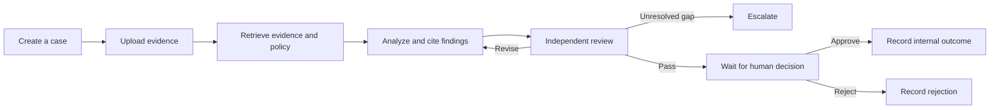

# Doci

**Document review grounded in evidence, with people in control of every decision.**

Doci turns uploaded documents and review policies into cited findings, an independently reviewed recommendation, and an auditable human decision. It combines a clear web workspace with durable agent workflows on Google Cloud.

**Python · FastAPI · React · TypeScript · LangChain · LangGraph · LangSmith · Google Cloud**

[Getting started](#getting-started) · [Using the workspace](#using-the-workspace) · [Architecture](docs/ARCHITECTURE.md) · [GCP deployment](docs/DEPLOYMENT.md) · [Operational scope](docs/OPERATIONS.md)

## What you can do

- **Manage cases:** create reviews, set priorities, search your casework, and follow progress.
- **Review documents:** upload PDF, TXT, Markdown, or CSV files and maintain a separate policy library.
- **Inspect the evidence:** open source citations and review the passages behind each finding.
- **Use independent review:** a second model chain checks the analyst's reasoning and citations.
- **Keep decisions accountable:** an authorized person approves or rejects the exact proposal with a recorded rationale.
- **Recover interrupted work:** durable checkpoints, authenticated task delivery, and idempotent action records support retries.
- **Observe the workflow:** optional LangSmith tracing and Google Cloud logging, monitoring, and traces support operations.

The interface uses neutral gray surfaces, readable text, visible focus states, and layouts that adapt to smaller screens.

## How a review works



The reviewer can request up to two revisions. A successful model review moves the case to **Needs approval**; it does not approve the case. The case creator and requesting analyst cannot make the final decision, even if they have an administrator role.

Approved actions record an **internal case disposition**, such as resolution or a request for more information. The application does not execute payments, open accounts, or send external messages.

## Getting started

### Requirements

- Python **3.12–3.14**
- Node.js **22 or later** and npm
- [uv](https://docs.astral.sh/uv/) for Python dependencies
- Docker only if you want the optional PostgreSQL setup

### Run locally

```bash
git clone https://github.com/sujaychandrakoyyalamudi/doci.git
cd doci
make setup
```

Start the API in one terminal:

```bash
make api
```

Start the web workspace in another:

```bash
make web
```

| Service           | Local address                 |
| ----------------- | ----------------------------- |
| Workspace         | http://127.0.0.1:5173         |
| API documentation | http://127.0.0.1:8000/docs    |
| Health check      | http://127.0.0.1:8000/healthz |

**Fresh installations start empty.** Bring your own policies and documents; no case datasets or document packs are included.

Local development requires no cloud credentials. Its `demo` model provider uses deterministic analysis to exercise workflow behavior, and its local role selector replaces sign-in. Use Vertex AI and Identity Platform for a deployed environment. SQLite data stays in the ignored `.data/` directory and supports one application process.

### Configure the environment

Defaults are sufficient for local development. To change them:

```bash
cp .env.example .env
```

Edit `.env` locally. It is excluded from version control. The template contains configuration names and placeholders, not working cloud credentials.

### Optional: run with PostgreSQL

Set a URL-safe `LOCAL_POSTGRES_PASSWORD` in your local `.env` file, then run:

```bash
docker compose up --build
```

Open http://127.0.0.1:8080. This runs the frontend and API together with PostgreSQL and pgvector. Reuse the same database password when restarting an existing database volume.

## Using the workspace

1. **Publish a policy.** A reviewer or administrator uploads the applicable rules under **Documents → Publish policy**.
2. **Create a case.** Enter a title, category, priority, and a clear description of what should be reviewed.
3. **Add evidence.** Upload supporting files inside the case with **Add document**. The upload limit is 15 MiB per file; additional PDF and OCR limits are described in the [operations guide](docs/OPERATIONS.md).
4. **Start review.** The application retrieves relevant passages, produces cited findings, and runs an independent review. The workspace updates automatically.
5. **Inspect the recommendation.** Use **Overview**, **Evidence**, and **Activity** to examine the findings, sources, and workflow history.
6. **Make an independent decision.** A different authorized person chooses **Approve proposal** or **Reject** and records a rationale.

In local development, select the reviewer role to publish a policy, the analyst role to create and review a case, and the separate approver role to make a decision. Deployed users receive trusted tenant and role claims through Identity Platform; there is no public role switch.

| Status              | What it means                                              |
| ------------------- | ---------------------------------------------------------- |
| Draft               | Documents can be added before starting a review.           |
| Queued / Processing | The background workflow is running.                        |
| Needs approval      | An independently reviewed proposal is waiting for a human. |
| Needs information   | Additional evidence is needed before another review.       |
| Escalated           | Unresolved evidence or policy issues need investigation.   |
| Rejected            | The human decision rejected the proposal.                  |
| Resolved            | An approved internal resolution has been recorded.         |
| Failed              | Use **Retry review** to resume the saved workflow.         |

## Technology and architecture

| Layer           | Implementation                                                         |
| --------------- | ---------------------------------------------------------------------- |
| Web workspace   | React, TypeScript, Vite                                                |
| Application API | Python, FastAPI, Pydantic, SQLAlchemy                                  |
| Agent chains    | LangChain with structured Gemini output                                |
| Workflow        | LangGraph with durable checkpoints and approval interrupts             |
| Observability   | Optional LangSmith traces, OpenTelemetry, Cloud Logging and Monitoring |
| Retrieval       | Gemini embeddings, pgvector, lexical ranking, and tenant/case filters  |
| Persistence     | Cloud SQL for records and checkpoints; Cloud Storage for documents     |
| Background work | Cloud Tasks and Cloud Run Jobs                                         |
| Authentication  | Identity Platform, trusted role claims, IAM service identities         |
| Infrastructure  | Terraform, Cloud Build, Artifact Registry, Cloud Run                   |

The API and frontend share one Cloud Run service. Optional integrations include MCP tools, a private A2A reviewer service, and Neo4j relationship retrieval. See the [architecture guide](docs/ARCHITECTURE.md) for component boundaries and data flow.

## Deploy to Google Cloud

Follow the [deployment guide](docs/DEPLOYMENT.md) to:

1. Configure a private Terraform state bucket and your project variables.
2. Provision the database, storage, service accounts, task queue, and authentication.
3. Build a tested container image and pin its immutable digest.
4. Deploy the application and, optionally, a custom-domain HTTPS load balancer.
5. Provision user accounts and assign trusted tenant/role claims.

Use `cloudbuild.bootstrap.yaml` for an initial image build and `cloudbuild.yaml` to build and deploy updates to an existing service. GitHub Actions validates the project; it does not automatically deploy or require GCP credentials.

Production configuration requires Firebase authentication, Vertex AI, PostgreSQL checkpoints, Cloud Storage, and Cloud Tasks. Custom-domain deployments restrict Cloud Run ingress to the load balancer and internal traffic.

## LangSmith and evaluation

LangSmith tracing is opt-in. Configure `LANGSMITH_TRACING`, `LANGSMITH_API_KEY`, and `LANGSMITH_PROJECT` through your deployment's secret-management process. Inputs and outputs are hidden by default.

Evaluation records stay outside the repository. Print the required schema, then provide your own private JSON dataset:

```bash
uv run python -m doci.evaluation --schema
make evaluate DATASET=private-data/evaluation.json
```

Use `--vertex` for live model evaluation. Adding `--langsmith` explicitly uploads the supplied evaluation records to your configured LangSmith workspace:

```bash
uv run python -m doci.evaluation \
  --dataset private-data/evaluation.json --vertex --langsmith
```

The optional workspace importer also accepts an external dataset and never creates human approvals. Its schema and deployment configuration are documented in the [deployment guide](docs/DEPLOYMENT.md#private-evaluation-datasets).

## Project structure

```text
backend/doci/          API, agents, workflow, retrieval, authentication, and integrations
backend/tests/        Automated behavior, authorization, recovery, and integration tests
frontend/             React workspace and shared visual styles
infra/                Reusable Terraform configuration and placeholder variables
docs/                 Architecture, deployment, and operational guidance
.github/workflows/    Continuous integration
Dockerfile            Application image with compiled frontend assets
compose.yaml          Optional local PostgreSQL environment
cloudbuild*.yaml      Initial-build and update-deployment pipelines
```

## Validation

```bash
make test
make check
terraform -chdir=infra init -backend=false
terraform -chdir=infra validate
terraform -chdir=infra fmt -check
```

The test suite covers role enforcement, tenant isolation, document validation, citations, approval separation, replay safety, recovery, dataset import boundaries, and A2A behavior. PostgreSQL integration runs when `TEST_POSTGRES_URL` points to a disposable pgvector database; CI provisions one automatically.

For meaningful changes, run the applicable checks and update the relevant documentation. Keep private inputs and generated output out of commits.

## Repository hygiene

Only application source, automated tests, dependency lockfiles, reusable infrastructure, and documentation belong here. Automated tests construct small temporary payloads in code; no business document collections are included.

The ignore rules exclude credentials, private configuration, Terraform state and plans, local databases, uploaded documents, case packs, generated files, dependencies, and deployment-specific records. Never commit a working `.env`, service-account key, access token, database export, or application-password file. See [SECURITY.md](SECURITY.md) for reporting and operational guidance.

## Scope and limitations

Doci is an initial implementation of a controlled review workflow. Model findings require human assessment; confidence values are not calibrated probabilities. Citation validation checks references, not the correctness of every inference. Policy retirement, database migrations for future schema changes, large-volume ingestion, and external action adapters require additional implementation.

See [Operational boundaries and recovery](docs/OPERATIONS.md) before extending the system to an operational workload.
