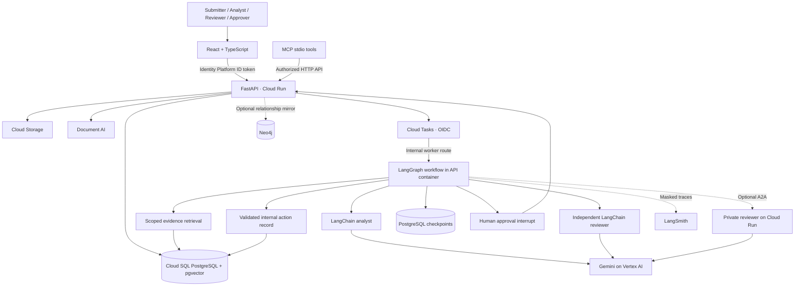

# Architecture

Doci pairs a Python FastAPI service with a React and TypeScript workspace. LangChain provides typed analyst and reviewer chains; LangGraph coordinates durable reviews and human approval; LangSmith provides optional tracing. Google Cloud hosts the application, models, storage, database, and task delivery.

## Data and execution

- **Cases** belong to a tenant derived from authenticated claims. Client bodies cannot select a tenant or approval identity.
- **Documents** are scoped to a case, or to the tenant's published policy library. Files use generated storage keys and retain a content hash. Policy publishing is restricted to reviewers/admins.
- **Chunks** retain the document and page references. Local search ranks text overlap. PostgreSQL search combines a vector shortlist and a lexical shortlist, reserving slots for both evidence and policy. There is no cross-case retrieval.
- **Runs** snapshot the graph's inputs and retrieved evidence in persisted checkpoints. There is one current run per case. Competing starts use a version-checked update.
- **Decisions** are immutable through the API and unique per run. The approver supplies a hash of the displayed proposal. Both the API and action node verify it.
- **Actions** have a unique run identifier. Recording an action and changing the case outcome share a database transaction. Retried deliveries reuse that action.
- **Audit events** are append-only through application routes. Their database is not a tamper-proof compliance archive.

PostgreSQL advisory locks serialize execution of the same run across Cloud Run replicas. Schema/checkpoint initialization also uses locks. The local SQLite mode serializes workflows in one process; it must not be scaled to multiple workers or replicas.

## Trust boundaries

The model receives a system prompt and a JSON data payload. Document passages, case descriptions, reviewer notes, and other model output are untrusted input. They cannot replace the system instructions. The model only selects from three internal dispositions: record a resolution, request information, or escalate.

All finding citations must exist in the run's evidence snapshot. This is a provenance check, not proof that every inference is correct. A separate reviewer chain checks support and applicability, with a bounded revision loop. Regardless of model output, the action node requires a persisted human approval from an independent identity.

The optional A2A reviewer receives only the evidence snapshot and proposal. It has no case-management tools. MCP calls the same role/tenant-enforcing API and exposes no approval creation tool. Optional Neo4j results are filtered again through the authoritative SQL scope.

## Agents and tool boundaries

The built-in workflow has two model chains: the case analyst and independent reviewer. Both use LangChain with Gemini structured output. Evidence retrieval, citation validation, approval persistence, and action execution are Python services invoked by LangGraph nodes. No MCP business tools are bound to the model chains.

| Workflow component | Actual call | Boundary |
| --- | --- | --- |
| Evidence step | `DocumentService.search(tenant_id, case_id, query)` | Searches case evidence and the tenant's policy library using scoped retrieval. |
| Analyst chain | `Agents.analyze(state)` → Gemini with the `Analysis` schema | Receives case context, evidence, and revision feedback; returns findings and a proposed action. |
| Independent review | `citation_errors(...)`, source checks, then `Agents.review(...)` when eligible | Missing sources escalate; invalid citations request revision. The model checks eligible proposals against their evidence. |
| Optional remote review | `remote_review(...)` over A2A | Delegates the evidence/analysis payload to a private reviewer service when configured. |
| Human checkpoint | `interrupt(...)`, persisted `Decision`, `Command(resume=...)` | Pauses until the API stores an independent decision, then verifies its proposal hash on resume. |
| Internal action | `Workflow.apply_action(state)` | Rechecks authorization and records the action in one transaction; a unique run ID prevents duplicate action records. |

The stdio [MCP integration](../backend/doci/integrations/mcp_server.py) exposes four tools to authorized external clients:

| MCP tool | API call | Effect |
| --- | --- | --- |
| `read_case` | `GET /api/cases/{case_id}` | Read the case, evidence snapshot, review, and human decision. |
| `search_evidence` | `GET /api/cases/{case_id}/search` | Search authorized case documents and published policies. |
| `request_review` | `POST /api/cases/{case_id}/reviews` | Queue a new review, subject to role and case-state checks. |
| `retry_approved_action` | Read the case, then `POST /api/runs/{run_id}/retry` | Require an existing approval before retrying the current run. It cannot create a human approval. |

LangSmith observes executions and receives review feedback. Cloud Logging, Cloud Trace, and Cloud Monitoring provide operational visibility. These integrations do not grant model chains permission to approve or execute actions.

## Deployment shape

The first version intentionally uses a modular Python service. The same Cloud Run container serves static frontend assets, public authenticated API routes, and an OIDC-protected task endpoint. Cloud Tasks provides durable delivery; an optional A2A reviewer runs in a separate private service. This avoids distributed write transactions while preserving the service boundaries in the design.

Document parsing and embedding happen synchronously on upload. This keeps ingestion atomic for the initial version; large-volume ingestion should move to a dedicated task/worker before scaling. Reindexing has an operator-run Cloud Run Job.

## Observability boundaries

Production tracing uses a dedicated LangSmith client with content filtering, selected metadata, deterministic review sampling, and bounded flushes. Input/output bodies, serialized components, event content, and exception messages are withheld. Numeric usage metadata supports token and available cost reporting. Root traces use unique execution UUIDs, grouped by the stable review ID.

Structured workflow and request events feed Cloud Logging metrics and a production dashboard. Request spans use route templates instead of raw paths or query values and are flushed before the final response byte. The monitoring API and console links are restricted to application administrators; cloud and LangSmith consoles retain their own authorization checks. See [observability](OBSERVABILITY.md).
